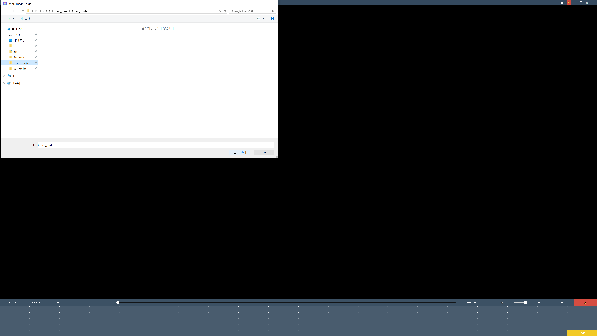
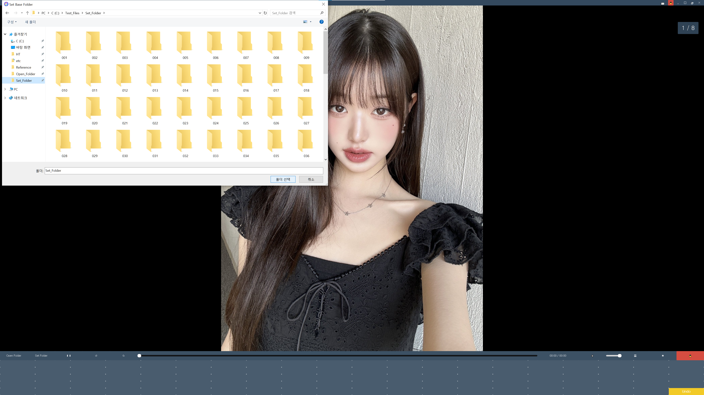
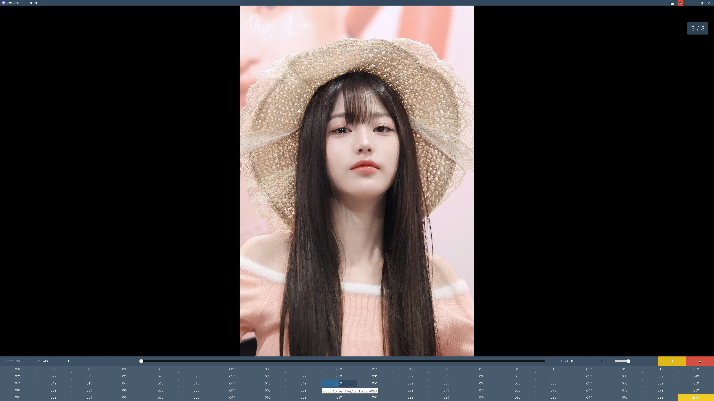
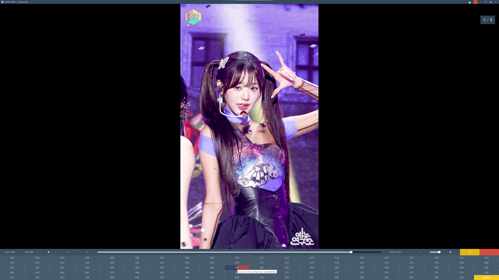

# ArchiveSift

ArchiveSift is a program that helps you sort and organize media files (images, animations, videos, and audio) into folders of your choice.

## Links

- [Download](https://github.com/htpaak/ArchiveSift/releases/tag/v1.0.0)
- [GitHub Repository](https://github.com/htpaak/ArchiveSift)
- [Feedback](https://github.com/htpaak/ArchiveSift/discussions)

## Demo

## Supported Extensions

### Images

- JPG/JPEG
- PNG
- BMP
- TIFF/TIF
- ICO
- JFIF
- JP2/JPE/JPS
- TGA

### Special Image Formats

- HEIC/HEIF
- AVIF

### RAW Formats

- CR2, NEF, ARW, ORF, RW2, DNG, PEF, RAF, SRW
- CRW, RAW, KDC, MRW, DCR, SR2, 3FR, MEF, ERF
- RWL, MDC, MOS, X3F, BAY, NRW

### Animations

- GIF
- WebP (animated)

### Videos

- MP4
- AVI
- MKV
- MOV/QT
- WMV
- FLV
- WebM
- MPG/MPEG
- VOB
- TS/M2TS
- M4V
- 3GP

### Audio

- MP3
- WAV
- FLAC
- AAC
- OGG
- M4A

### Design Files

- PSD (Photoshop)
